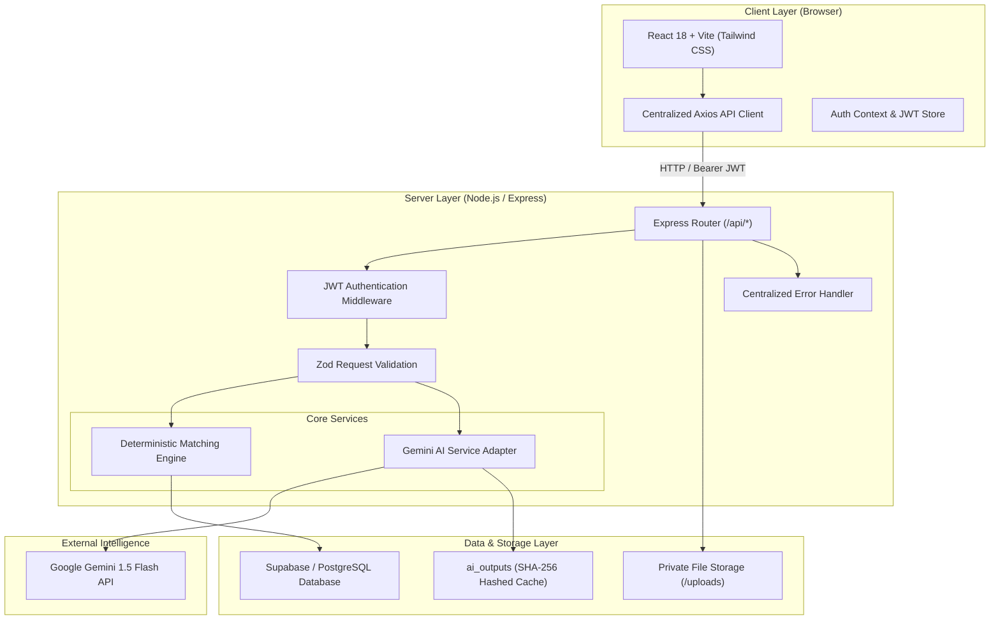
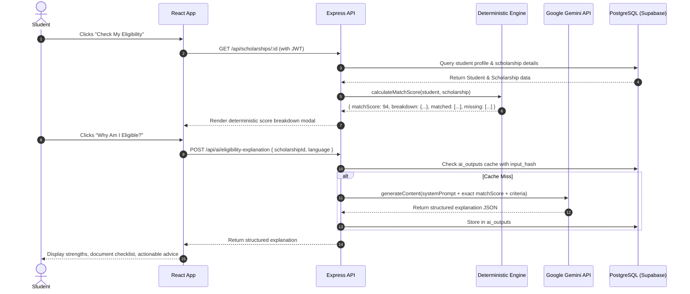

# ScholarNest — System Architecture

This document details the architectural design, security boundaries, and data flow of the ScholarNest platform.

---

## 1. High-Level Architecture Diagram

---

## 2. Layer-by-Layer Breakdown

### A. Client Layer (React + Vite)
- **Role:** Pure presentation, client-side routing, and responsive state synchronization.
- **Security Constraint:** Never possesses direct access to `GEMINI_API_KEY`, `SUPABASE_SECRET_KEY`, or `DATABASE_URL`.
- **API Communication:** All requests route through a single centralized Axios instance (`frontend/src/services/api.js`). 
- **Session Handling:** JWT stored in `localStorage`, injected into the `Authorization: Bearer <token>` header by an Axios request interceptor. Automatic session expiration handling on HTTP 401.

### B. Express API Layer
- **Role:** Business logic execution, authentication enforcement, parameter validation, and orchestrating database transactions.
- **Deterministic Separation:** All match score math is performed in JavaScript on the backend (`matchingService.js`), guaranteeing consistency and removing AI non-determinism.
- **Data Isolation:** Every single user query enforces ownership with `WHERE user_id = $1` extracted directly from the verified JWT token (`req.user.id`). User A cannot access or mutate User B's records under any circumstance.
- **Centralized Error Handling:** All runtime exceptions pass to `errorHandler.js`. Internal database error strings, table names, and stack traces are suppressed in production.

### C. Database Layer (Supabase PostgreSQL)
- **Tables:** `users`, `students`, `scholarships`, `saved_scholarships`, `applications`, `documents`, `notifications`, `ai_outputs`.
- **Integrity Constraints:** Foreign keys (`ON DELETE CASCADE`), unique constraints (`user_id, scholarship_id`), check constraints on statuses (`SAVED`, `INTERESTED`, etc.).
- **Indexing:** Targeted B-Tree indexes on `email`, `user_id`, `deadline`, and `is_read` to ensure sub-millisecond query execution.

### D. AI Integration Layer (Google Gemini)
- **Model:** `gemini-1.5-flash` via `@google/generative-ai`.
- **Isolation:** Never invoked directly from React.
- **Structured JSON Output:** Responses are constrained by system prompts and parsed into JSON schemas.
- **Deduplication / Caching:** Results are hashed with SHA-256 and stored in `ai_outputs` to minimize token consumption and latency.

---

## 3. Data Flow: "Why Am I Eligible?" Request

---

## 4. Security Principles

1. **Least Privilege Data Access**: Users cannot specify another user's ID in queries or updates. The `user_id` is always overridden by `req.user.id` from the cryptographically verified JWT.
2. **Private Document Storage**: Files uploaded via `/api/documents` are stored in an unexposed backend directory with randomized unique hashes (`${timestamp}-${random}-${filename}`). They cannot be reached by direct browser URL browsing.
3. **Password Security**: Passwords hashed with `bcryptjs` using 10 salt rounds prior to persistence. Raw passwords are never logged or stored.
4. **Environment Isolation**: Production secrets are managed entirely through environment variables (`DATABASE_URL`, `JWT_SECRET`, `GEMINI_API_KEY`).
